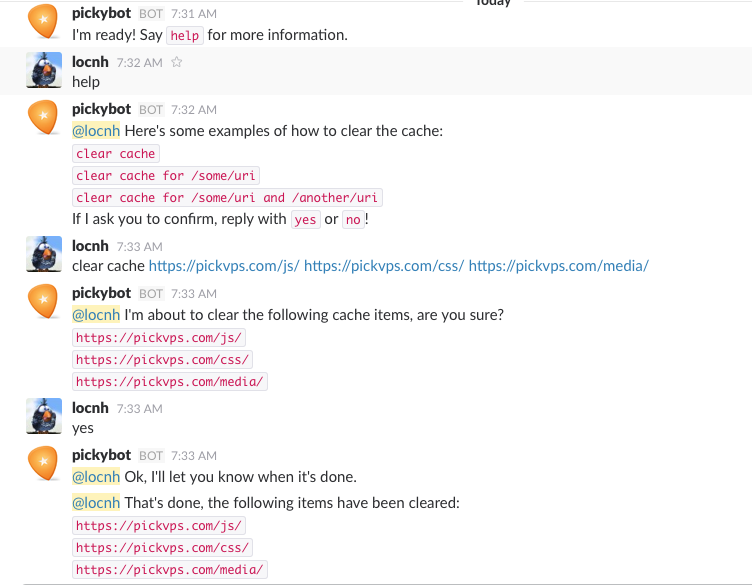

CF Cache Bot
========

A [Slack](https://slack.com/) bot for [CloudFlare](https://www.cloudflare.com/).



### Configuration

Configure cachebot using environment variables:

| Environment variable | Description
| -------------------- | -----------
| AUTHORISED_USERS     | Users authorised to use cachebot
| CF_TOKEN             | CloudFlare API token
| CF_EMAIL             | CloudFlare account e-mail
| CF_ZONE              | CloudFlare Zone ID
| RESTRICTED_CHANNELS  | Channels which require an authorised user
| SLACK_TOKEN          | Slack API token

### How to start

Choose one of the ways below:

1. Use pre-compiled for Mac OS X / Linux (amd64)

  ```
  bin/cachebot_<os>_amd64 -cloudflare-email CF-EMAIL -cloudflare-token CF-API-TOKEN -slack-token SLACK-TOKEN -cloudflare-zone example.com -restricted-channels SLACK-CHANNEL -authorised-users SLACK-USER
  ```

2. Compile and run by yourself

  ```
  $ make
  $ cachebot_<os>_amd64 -cloudflare-email CF-EMAIL -cloudflare-token CF-API-TOKEN -slack-token SLACK-TOKEN -cloudflare-zone example.com -restricted-channels SLACK-CHANNEL -authorised-users SLACK-USER
  ```

3. Docker

  ```
  $ docker pull locnh/cloudflare-slackbot
  $ docker run --name cfslackbot -e CF_EMAIL=<cf-email> -e CF_TOKEN=<cf-token> -e SLACK_TOKEN=<slack-token> -e CF_ZONE=example.com -e RESTRICTED_CHANNELS=<slack-channels> -e AUTHORISED_USERS=<slack-users> -d locnh/cloudflare-slackbot
  ```

### Usage

1. Start cachebot
2. `/invite` cachebot to a channel
3. Ask cachebot to clear your cache:
  - `clear cache`
  - `clear cache for /some/uri`

### Authorised users / restricted channels

By default, cachebot will allow any user to clear the cache.

With a restricted channel set, access is restricted to a set of authorised users.

For example, if you have a channel with guest users in, you can limit use of
cachebot to specific named users.

Example:

```bash
# Only 'foo' and 'bar' users can use cachebot in the 'support' channel.
# cachebot works as normal in all other channels.
AUTHORISED_USERS=foo,bar
RESTRICTED_CHANNELS=support
```

### Elastic Beanstalk

If you deploy to Elastic Beanstalk, you'll need to add an `EXPOSE` line to
the Dockerfile. Cachebot doesn't listen on any ports, but Elastic Beanstalk
prevents deployments of apps without it.

### Credit

This bot was forked from [ian-kent](https://github.com/ian-kent/cachebot) and rewritten with [cloudflare-go](https://github.com/cloudflare/cloudflare-go).
I also removed BASE_URI, URI_SUFFIX and used full URLs of files to be cleared from CF Cache, that means we actually can clean cache for subdomain and don't be limited inside the `CF Zone`

### License

Released under MIT license, see [LICENSE](LICENSE.md) for details.
